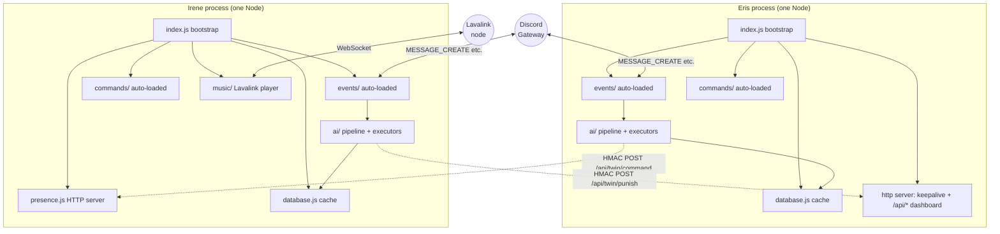
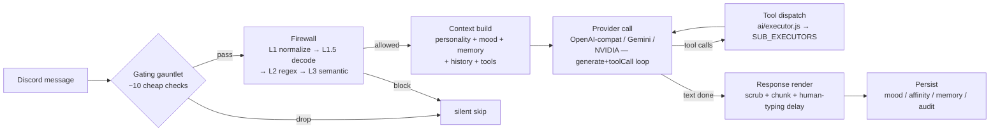

# Architecture

End-to-end shape of the repo: what runs, where state lives, how the two bots coordinate, and what the seams are if you want to fork or replace a piece. Skim once for the map; jump to the section you're editing. The pipeline-level traces live in [docs/ai-pipeline-eris.md](docs/ai-pipeline-eris.md), [docs/ai-pipeline-irene.md](docs/ai-pipeline-irene.md), and [docs/presence-api.md](docs/presence-api.md) — this doc tries not to duplicate them.

## 1. High-level overview

Three workspace packages under `packages/*`:

| Package | What it is | Lines (approx) |
|---|---|---|
| `@defnotean/eris` | Discord bot focused on chat / economy / gambling / games / "fun". No moderation tools. | ~75k JS |
| `@defnotean/irene` | Discord bot focused on moderation / server config / music / tickets / presence API. No economy tools. | ~95k JS |
| `@defnotean/shared` | Cross-bot utilities published only to the workspace (HMAC twin signing, LRU cache, role categorizer, SSRF-safe fetch, rate limiter, firewall core). | ~5k JS |

The shared package is a workspace dependency only — both bots import via subpath exports declared in [packages/shared/package.json:8-20](packages/shared/package.json#L8-L20), e.g. `import { LRUCache } from "@defnotean/shared/LRUCache"`. Bot-specific adapters remain where dependencies differ.

**Twin-bot mode.** Both bots run as independent processes and coordinate over HTTPS via the HMAC-signed "twin protocol" hosted by Irene's HTTP server. Eris delegates moderation to Irene via `ask_irene`; Irene fires confiscation signals at Eris via `firePunishSignal`; both bots can read the other's mood for context.

**Single-bot mode.** Each bot also runs standalone. With `TWIN_API_SECRET` / `IRENE_API_URL` unset, twin calls degrade silently — `ask_irene` returns "couldn't reach irene" to the model, `twinState` returns empty context, `firePunishSignal` logs and the moderation action stands alone. Nothing blocks on the twin being reachable.

**What's shared end-to-end:**
- HMAC twin signing protocol ([packages/shared/src/twinSign.js](packages/shared/src/twinSign.js))
- LRU cache used by the tool result cache and others ([packages/shared/src/LRUCache.js](packages/shared/src/LRUCache.js))
- SSRF-hardened `fetch` wrapper, in-memory rate limiter, role categorizer, firewall core + patterns

**What's intentionally per-bot:** personality prompts, long-term memory schemas, dispatch routers, and `dual.js` (the AI orchestration loop is shaped differently for each bot's tool surface — see drift inventory).

## 2. Process model

One Node process per bot. No multi-shard sharding (sized for small-to-mid creator communities — see [docs/start-here.md](docs/start-here.md)).



**Boot order matters for Irene** ([packages/irene/index.js:256-264](packages/irene/index.js#L256-L264)): `startPresenceAPI` runs *first* so Render's port-detection timeout doesn't kill the dyno before Discord login completes. Then `initDatabase` → `loadCommands` → `loadEvents` → `registerCommands` → `client.login` → `setupLavalink` (Shoukaku needs the gateway alive). Eris is simpler ([packages/eris/index.js:107-131](packages/eris/index.js#L107-L131)): `initDatabase` → `loadCommands` → `loadEvents` → `client.login` → start HTTP keepalive + dashboard.

**Auto-loaders.** Both bots glob-import `events/*.js` and `commands/**/*.js` at boot. Event filename → Discord event name (`messageCreate.js` binds to `MESSAGE_CREATE`). Each handler is wrapped in try/catch so a single misbehaving event can't kill the process. See [packages/eris/index.js:63-93](packages/eris/index.js#L63-L93) and [packages/irene/index.js:104-169](packages/irene/index.js#L104-L169).

**Lifecycle hooks.**
- `SIGTERM` / `SIGINT` → graceful shutdown: flush `database.js`, `ai/personality.js`, `ai/longmemory.js` buffers, then `client.destroy()`. Irene additionally saves music queues first and caps the flush at 8 s ([packages/irene/index.js:320-354](packages/irene/index.js#L320-L354)) because Render `SIGKILL`s ~10 s after `SIGTERM`.
- `beforeExit` (Eris only, [packages/eris/database.js:166-176](packages/eris/database.js#L166-L176)) — fallback drain for clean exits that skip SIGTERM (e.g. test runners).
- `unhandledRejection` / `uncaughtException` are logged but never crash the process. The bot keeps running.
- Irene also wires `shardResume` to re-warm guild caches and prune stale temp-VC state ([packages/irene/index.js:183-225](packages/irene/index.js#L183-L225)).

## 3. Discord ingress

discord.js v14 client per process. Intents are bot-scoped: Eris asks for guild messages + content + members + DMs + presences + reactions ([packages/eris/index.js:22-31](packages/eris/index.js#L22-L31)); Irene additionally requests voice states, moderation, invites, emojis, scheduled events, and auto-moderation ([packages/irene/index.js:28-43](packages/irene/index.js#L28-L43)) — that's the surface area difference between "chat companion" and "server-management bot".

Event flow per message:

```
Discord gateway → client.on("messageCreate") → events/messageCreate.js → execute(message)
                                                                            ↓
                                                              [gating gauntlet — §4 of pipeline docs]
                                                                            ↓
                                                              [context build → AI call → tool dispatch → reply]
```

Slash commands flow through `events/interactionCreate.js` which looks up the command in `client.commands` (populated by `loadCommands()`) and invokes its `execute(interaction)`.

## 4. AI pipeline

The same seven-stage pipeline shape on both bots (firewall → context → provider call → tool dispatch → render → persist). The bot-specific traces are in [docs/ai-pipeline-eris.md](docs/ai-pipeline-eris.md) and [docs/ai-pipeline-irene.md](docs/ai-pipeline-irene.md). Map view:



Most messages bail at gating before spending a token. Of the messages that pass, the firewall ([packages/shared/src/ai/firewall.js](packages/shared/src/ai/firewall.js), wrapped by per-bot adapters) runs four detection layers; if all pass, the AI loop runs `MAX_ITERATIONS` rounds of generate → tool-call → tool-result → generate, hard-capped by an outer `Promise.race` (worker 60-90 s, fast 35-45 s, configurable in `config.timeouts`).

Per-tool budgets, key pool rotation, fallback-model retries, and the `quickReply` fast-path are all in `ai/providers/*` (Eris uses an NVIDIA→Gemini fallback router; Irene is single-provider) and `ai/dual.js`. See the per-bot pipeline doc for line-level pointers.

## 5. Tool surface

Single dispatch entry on each bot: `executeTool(toolName, input, message)` in `ai/executor.js`. It applies four layers before invoking the actual handler:

1. **TOOL_ALIASES** — hand-curated map for model name drift (e.g. `play → play_music`, `coinflip → coinflip_bet`). Eris's map has ~150 entries ([packages/eris/ai/executor.js:37-135](packages/eris/ai/executor.js#L37-L135)); Irene's is smaller and similar.
2. **Per-user rate limit** via `utils/toolRateLimit.js` — expensive tools (web search, image, terminal) are capped per user per window.
3. **Read-only cache** — `LRUCache(200, 15_000)` keyed by `userId:toolName:JSON(args)`. `CACHEABLE_TOOLS` is the allowlist; `CACHE_INVALIDATING_TOOLS` clears the user's cache after writes; `TWO_USER_TOOLS` (transfers, rob, trade, marry) also clears the target's cache ([packages/eris/ai/executor.js:140-201](packages/eris/ai/executor.js#L140-L201)).
4. **Sub-executor walk** — iterate the `SUB_EXECUTORS` array, first non-`undefined` result wins. Each sub-executor declares its `HANDLED` Set and returns a string result or `undefined`.

**Eris sub-executors** ([packages/eris/ai/executors/](packages/eris/ai/executors/)): `memory`, `media`, `web`, `notes`, `system`, `github`, `admin`, `twin`, `gambling`, `game`, `casino`, `misc`. Plus three legacy in-place executors dispatched by hardcoded tool-name sets: `economyExecutor`, `activityExecutor`, `socialExecutor`.

**Irene sub-executors** ([packages/irene/ai/executors/](packages/irene/ai/executors/)): `channel`, `role`, `moderation` (with `checkHierarchy`), `voice`, `setup`, `personalize`, `audio`, `leveling`, `advanced`, `memory`, `toggle`, `message`, `server`. The `setupExecutor` is composite — owns welcome / verify / reaction-roles / starboard / ticket flows. A residual `switch` in `executor.js` handles tools not yet extracted.

**Tier model (planned — not yet wired).** `ai/toolRegistry.js` implements a two-tier split: tools in `_alwaysInclude` (memory, web, GIF, notes, mood) plus the matched-category tools would form Tier 1 (full schemas), and the rest would become a Tier 2 name-only catalog appended to the prompt, with the executor dispatching by name regardless. **Neither bot uses this path in the live message loop today.** Eris's `events/messageCreate/toolProfiles.js` sends a full, profile-filtered schema every turn (twin / chat / task profiles, plus owner tools), and Irene's `messageCreate.js` sends all tools every message; the registry's `getToolsFor()` tiering is implemented but not yet called from the hot path. From the registry the live code consumes only `getEconomyMutatingTools()`. The registry is tracking usage for when Tier 2 is wired in.

Hallucinated tool names accumulate in `_unknownToolCounts` and get logged at hit #1 and every 10th hit thereafter so prompt drift becomes visible.

## 6. Persistence layers

Both bots use **Supabase Postgres as the durable store**, with a hot in-memory cache as the source of truth for reads, and **debounced background flushes** for writes. Tables are prefixed per bot (`eris_*` / `irene_*` / `bot_data`).

```
read:   handler → in-memory cache (sync) → return
write:  handler → mutate cache (sync) → mark bucket dirty → debounced timer → Supabase upsert
```

**Eris** flushes at ~200 ms debounce on a bucket basis — only the dirty buckets (`mood`, `relationships`, `guild_settings`, …) flush ([packages/eris/database.js:126-158](packages/eris/database.js#L126-L158)). On flush failure the bucket is re-queued for the next cycle. A `beforeExit` hook drains the queue with a 3 s cap. The conversation table is too large to mirror in memory — it's read/written directly against Supabase.

**Irene** flushes at ~2 s debounce as a whole-object snapshot ([packages/irene/database.js:185-189](packages/irene/database.js#L185-L189)). `flushNow()` is the SIGTERM-drain entry point. An optional per-entity dual-write fanout splits the snapshot into per-guild rows when `config.dualWritePersistence` is on; see [packages/irene/database/perEntity.js](packages/irene/database/perEntity.js).

**In-memory fallback.** If `SUPABASE_URL` / `SUPABASE_KEY` are missing or invalid the bot still boots and runs entirely from memory — all state resets on restart. `REQUIRE_PERSISTENCE=1` flips that to fail-fast at boot. Eris loud-warns at startup ([packages/eris/config.js:404-406](packages/eris/config.js#L404-L406)); Irene multi-line loud-warns ([packages/irene/database.js:105-110](packages/irene/database.js#L105-L110)).

**Atomic ops.** Per-user mutations that read-then-write the same row (economy balance, gambling, crafting, loot boxes) go through `withUserLock(userId, fn)` ([packages/eris/database.js:642](packages/eris/database.js#L642)) which serializes via an in-memory promise chain keyed by `userId`. Per-channel message handling is serialized via a similar `withLock` mutex inside `messageCreate.js` so two concurrent messages in the same channel don't race the AI state.

**Where the data lives by category.**
- Conversations: Supabase direct (Eris `eris_memories`; Irene `bot_data.conversations` debounced).
- Per-guild settings, directives, rules: `data.guild_settings[guildId]` in memory, flushed.
- Mood, affinity, personality drift, long-term memory: in-memory + Supabase, mostly via `ai/*.js` modules with their own flush schedules — explicitly drained at SIGTERM alongside `database.js`.
- Economy / pet / inventory / games: per-user rows in `eris_economy` and friends, cached with TTL, write-through via `withUserLock`.

## 7. Twin coordination

The HMAC twin protocol turns the two bots into a loosely-coupled pair. Authoritative reference is [docs/presence-api.md](docs/presence-api.md); summary here:

- **Single Node `http` server on Irene** ([packages/irene/presence.js:100](packages/irene/presence.js#L100)) hosts everything: public `/presence/:userId` (Lanyard replacement), `/health`, `/tts/:id` (Lavalink TTS audio), Base44 dashboard `/api/*`, twin endpoints `/api/twin/state` (Bearer) and `/api/twin/command` (HMAC).
- **Eris's HTTP server** ([packages/eris/index.js:96-104](packages/eris/index.js#L96-L104)) is dual-purpose: a keepalive root + `/api/*` routed to `api/dashboard.js`, which hosts `POST /api/twin/punish` (HMAC) and `GET /api/twin/state` (Bearer).

**Two auth schemes on the same secret `TWIN_API_SECRET`:**
- **HMAC** for state-changing endpoints. Headers `X-Twin-Timestamp` + `X-Twin-Signature = hex(HMAC_SHA256(secret, "${ts}.${rawBody}"))`. Verifier ([packages/shared/src/twinSign.js:65](packages/shared/src/twinSign.js#L65)) rejects malformed sigs, ±60 s skew, replay (in-memory `Map` of seen sigs pruned at 2× skew), and uses `timingSafeEqual` for the compare. A fail-loud pressure cap rejects new requests at ≥10k unexpired entries rather than evict legit sigs.
- **Bearer** (`Authorization: Bearer <TWIN_API_SECRET>`) for read-only endpoints — no replay protection because endpoints are side-effect-free.

**Caller patterns.**
- `ask_irene` (Eris LLM tool) — Eris does its own role-gate, builds JSON, signs, POSTs `/api/twin/command`. Irene re-verifies HMAC, re-verifies requester is owner/trusted, maps short command name (`ban`) to real tool (`ban_user`), and runs through `executeTool` with a synthesized message context whose `member` is the *requester*, not the bot — so hierarchy checks bind to the human.
- `twinState` (Eris read) — Bearer GET, cached 5 min, 4 s timeout, silent failure. Used so Eris can reference Irene's actual current mood in context instead of hallucinating one.
- `firePunishSignal` (Irene → Eris) — fire-and-forget HMAC POST to `/api/twin/punish` after a ban/kick. Eris checks the guild's `cross_bot_punish` opt-in and confiscates the user's balance if true.
- `ask_eris` (Irene LLM tool) — sub-actions `remind | note | fact | mood | status` routed through `callEris(path, opts)`. POSTs are signed; GETs are unsigned.

**Rate limits.** Public `/presence` is 1/s/IP; dashboard `/api/*` is 30/min/IP; `/api/twin/state` is additionally 10/min/IP via the shared `createRateLimiter` so a leaked Bearer can't be used to scrape mood at high resolution. Twin-command body is capped at 10 KB; oversize destroys the socket.

## 8. Configuration

Configuration is env-only. Each bot has a `config.js` that synchronously parses `.env` (manual parser to avoid system-env conflicts), then exposes a single `config` object. `process.env` wins over local `.env` so deployed values override.

**Required for any bot to boot:**
- `DISCORD_TOKEN` (Eris) / `DISCORD_BOT_TOKEN` (Irene) — fail-fast if missing.
- `CLIENT_ID` (Eris) / `DISCORD_CLIENT_ID` (Irene) — needed for slash command registration.

**AI provider selection** via `AI_PROVIDER` (default `gemini`). Recognized values fall in three buckets:
- `gemini` / `google` — requires at least one `GEMINI_API_KEY` (up to 4 keys pooled).
- `nvidia` / `kimi` — requires `NVIDIA_API_KEY`.
- Any OpenAI-compatible alias: `openai`, `openrouter`, `groq`, `cerebras`, `mistral`, `deepinfra`, `together`, `github`, `cloudflare`, `lmstudio`, `ollama`. Requires `OPENAI_COMPAT_API_KEY` (or the provider-specific alias key) unless running a local provider (`lmstudio`/`ollama`).

Validation is in [packages/eris/config.js:373-402](packages/eris/config.js#L373-L402). Models, temperatures, top-p, max tokens, tool-choice, and HTTP referer/title are all per-provider env vars. See [docs/llm-provider-guide.md](docs/llm-provider-guide.md) for the supported matrix.

**Persistence** — `SUPABASE_URL` + `SUPABASE_KEY` (warn-and-continue if missing; `REQUIRE_PERSISTENCE=1` to fail-fast instead).

**Twin coordination** — `TWIN_API_SECRET` (must match across both bots), `IRENE_API_URL` on Eris, `ERIS_API_URL` on Irene, plus owner / twin Discord IDs (`BOT_OWNER_ID`, `TWIN_BOT_ID`, `DISCORD_USER_ID`, `ERIS_BOT_ID`). Per [user memory](.) and the open-source release commit (b59e54c), no Discord IDs or URLs are hardcoded — all env.

**Optional integrations** (warn-and-skip if missing):
- `LASTFM_API_KEY` — Eris `/fm` commands
- `KLIPY_API_KEY` — Eris GIF tool
- `VOYAGE_API_KEY` — semantic firewall + memory embeddings
- `BRAVE_SEARCH_API_KEY` / `BRAVE_ANSWERS_API_KEY`, `TAVILY_API_KEY`, `SERPER_API_KEY`, `GOOGLE_SEARCH_KEY`+`GOOGLE_SEARCH_CX`, `SEARXNG_QUERY_URL` — web-search backends (router in `webExecutor`)
- `GITHUB_TOKEN`, `GOOGLE_CLIENT_ID/SECRET/REFRESH_TOKEN`, `RENDER_API_KEY` — agentic-tool integrations
- Irene Lavalink: `LAVALINK_HOST`, `LAVALINK_PORT`, `LAVALINK_PASSWORD`, `LAVALINK_SECURE`
- `PC_AGENT_DISABLED=1` — kill switch for owner-only machine-level tools
- `DASHBOARD_API_KEY` — alternate bearer for the Base44 dashboard reads

Tunables (cooldowns, history budgets, embed colors, request timeouts) live in the same `config.js` files and are overridable via `TIMEOUT_*` env vars.

## 9. Deployment shapes

### A. Render multi-service (canonical)

The root `render.yaml` describes two web services in one repo, each pinned to the monorepo root so the workspace dependency on `@defnotean/shared` resolves.

- `eris-bot` — `plan: free`, `npm install && npm run start:eris`, healthcheck `/`.
- `irene-bot` — `plan: standard`, `npm install && npm run start:irene`, healthcheck `/api/health`.
- Both services share the same `TWIN_API_SECRET`; Eris's `IRENE_API_URL` points at Irene's Render URL. Self-hosters and forks pick their own service names.

### B. Self-host single-host

Both bots on one box (laptop / home server / VPS) — see [docs/self-hosting.md](docs/self-hosting.md) for OS specifics, process managers (systemd / pm2 / nssm), networking (port forwarding for the twin link, reverse proxy for the presence API), and a local Lavalink for music. The bots talk to each other over `localhost:<port>` with the same HMAC protocol.

### C. Single-bot

Deploy only Eris or only Irene. With `TWIN_API_SECRET` unset, twin tools silently degrade — the bot is fully usable on its own; it just can't delegate to a sibling. Useful for forks that only want the moderation surface or only the chat-companion surface.

## 10. Boundaries & extension points

Where to cut into the system without spreading change across the codebase:

| You want to... | Cut here | Notes |
|---|---|---|
| Add a new AI tool | `ai/tools.js` (schema) + `ai/executors/<domain>.js` (handler) + `ai/toolRegistry.js` (category) + tests | Reference tools flagged `// ─── REFERENCE TOOL ───` in each bot. See [docs/cheatsheet.md](docs/cheatsheet.md) §1. |
| Swap LLM provider | `AI_PROVIDER=<name>` env var | OpenAI-compat, Gemini, NVIDIA, local (LM Studio / Ollama) all supported. See [docs/llm-provider-guide.md](docs/llm-provider-guide.md). |
| Add a Discord event | Drop `events/<eventName>.js` | Auto-loaded by filename. |
| Add a slash command | `commands/<category>/<name>.js` + `npm run deploy --workspace=@defnotean/<bot>` | |
| Change personality | `prompts/*-personality.md` | Reloaded on bot restart, no code change. |
| Change gating / mention rules | `events/messageCreate.js` | Both bots — section dividers match the pipeline-doc stages. |
| Replace persistence backend | `database.js` | Sync read API, debounced write — anything implementing the same shape works. Per-bot. |
| Add a twin-relayed command | `TWIN_ALIASES` in `presence.js` (Irene) + `ask_irene` enum in `twinExecutor.js` (Eris) | HMAC + auth checks are inherited. |
| Add a new HTTP endpoint | `packages/irene/presence.js` (Irene-hosted) or `packages/eris/api/dashboard.js` (Eris-hosted) | Both already enforce Bearer / HMAC and the shared rate limiter. |
| Add a new shared utility | `packages/shared/src/*.js` + export from `package.json` `exports` map | Then bump the version pin in both bots' `package.json` and run `npm run lint:version-sync`. |

**Hard boundaries** (don't try to merge these):
- Personality, mood, long-term-memory schemas — each bot owns its tables, prefixed `eris_*` / `irene_*`.
- Tool surfaces — Eris has no moderation tools, Irene has no economy tools, by design.
- `dual.js` per bot — the AI orchestration loop is shaped for each bot's tool surface.

**What is *not* in the codebase** (might be expected, isn't):
- No CI other than the version-sync linter.
- No staging environment — production tests happen in a dev guild ([docs/dev-guild-workflow.md](docs/dev-guild-workflow.md)).
- No multi-shard sharding — one Node process per service.
- No structured log shipping — `console.log` + a 5 MB-rotating `bot.log` per package.
- No TypeScript compile step — ESM JS throughout, `tsconfig.json` only for editor JSDoc support.

If you're new to the repo, [docs/start-here.md](docs/start-here.md) is the 10-minute orientation; come back here when you need the system-level view.
